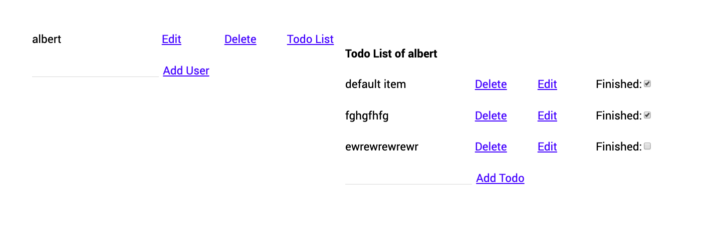

### Apollo fullstack Todo List Demo

#### How to use

- `cd server && yarn && yarn start`
- `cd client && yarn && yarn start`
- Server on `localhost:4000` and Client on `localhost:3000`

#### Config for Client

1. Create react app with typescript
2. install apollo-boost for writing gql query and ApolloClient. install @apollo/react-hooks for useQuery and useMutation.

#### Config with Server

1. TypeScript with Nodemon to hot-reload graphql server
2. Schema, resolvers on the same file for simplification
3. No dataSource and database support yet (To do)

#### Development flow

Schema -> Resolver / dataSource -> Write Query -> Test with GQL playground -> Implement on Client
